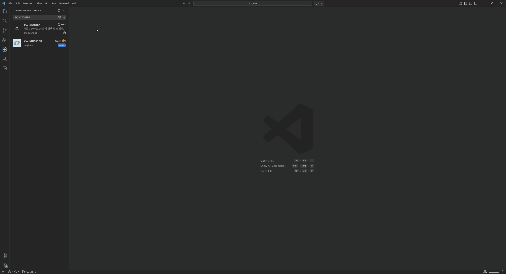

# BOJ-STARTER

BOJ-STARTER는 [백준](https://www.acmicpc.net/)의 문제를 빠르고 쉽게 검색하고 풀 수 있도록 도와주는 Visual Studio Code 의 Extension 입니다.
해당 Extension을 사용하면 vscode 내에서 **문제를 검색해서 문제 파일을 열고, 문제 정보를 확인**하며, **테스트 케이스의 실행/추가/수정/삭제** 까지 쉽게 할 수 있습니다.

# 주요 기능

## 1. 문제 찾기 (좌측 패널)
* 문제를 제목, 태그, 번호로 검색이 가능합니다.
## 2. 문제 파일 생성 (좌측 패널)
* 파일 생성 버튼을 클릭하여, 파일을 생성 할 수 있습니다.
* 폴더명 - (문제번호 - 문제제목 **1000번 - A+B**) / 파일명 - (문제번호.확장자 **1000.java**)
## 3. 문제 보기 (좌측 패널)
* 문제 보기 버튼을 클릭해서 생성한 문제의 내용을 확인할 수 있습니다.

## 4. 테스트 케이스 추가
* 사용자가 원하는 테스트 케이스를 추가/수정/삭제가 가능합니다.
## 5. 테스트 케이스 실행
* 기본 테스트 케이스와 사용자가 추가한 테스트 케이스 모두 실행 가능합니다.
# 요구 사항

BOJ-STARTER를 사용하기 위해서 해당 **언어의 실행 환경이 반드시 필요**합니다.

# 설정

* 좌측 패널의 `설정 열기` 버튼
* vscode 설정에서 bojSearch 검색

| 설정 키                        | 설명                                   | 기본값    |
| --------------------------- | ------------------------------------ | ------ |
| `bojSearch.defaultLanguage` | 기본 생성 언어 확장자 (`py`, `cpp`, `java` 등) | `py`   |
| `bojSearch.outputDir`       | 워크스페이스 기준 생성 상대 경로                   | `.`    |
| `bojSearch.maxRecent`       | 최근 문제 보관 개수                          | `50`   |
| `bojSearch.openWebOnSelect` | 파일 생성 동작 시 BOJ 페이지 자동 열기             | `true` |
| `bojSearch.runnerCommands`  | 언어별 실행/컴파일 명령어 맵                     | 환경별 상이 |
| `bojSearch.compilerOptions` | C/C++/Rust 컴파일 옵션                    | 빈 문자열  |
